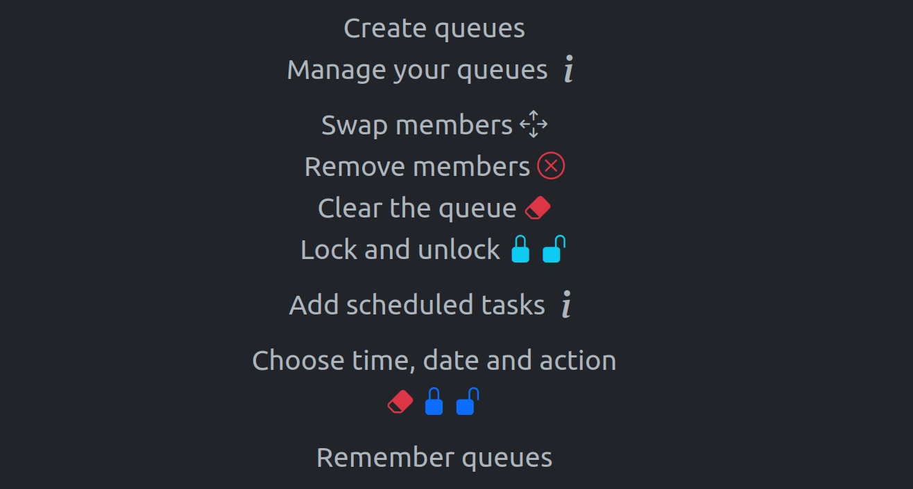
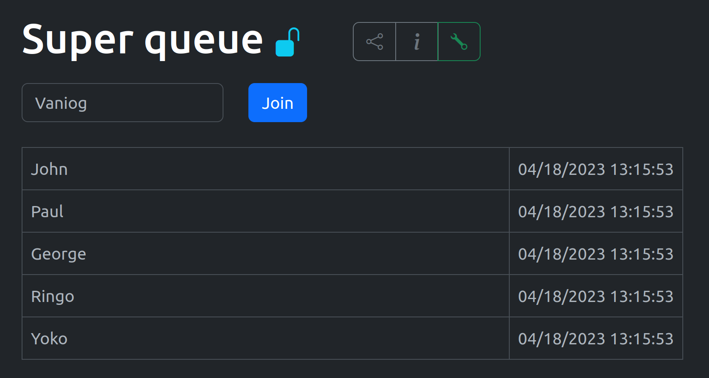
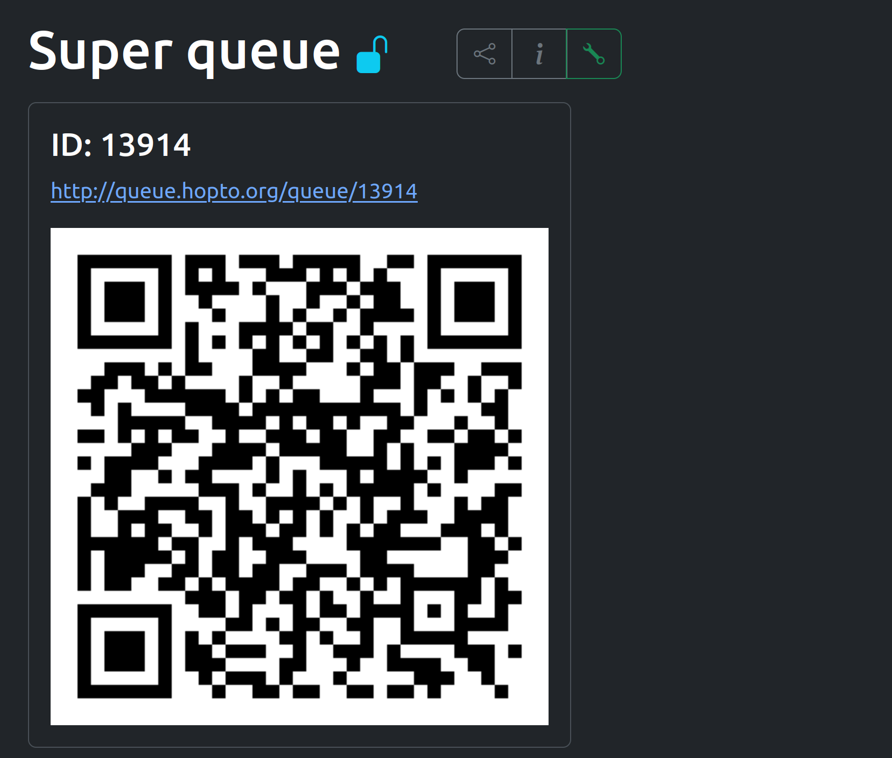
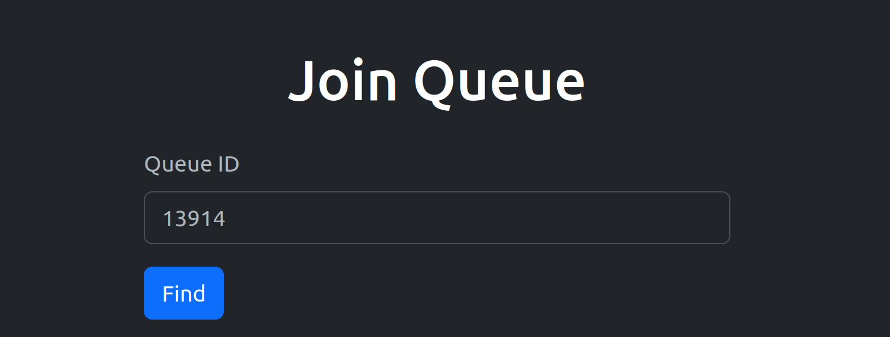
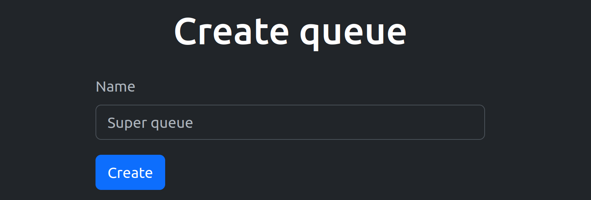
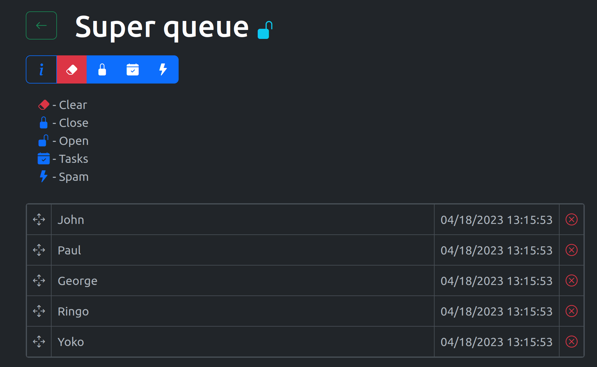
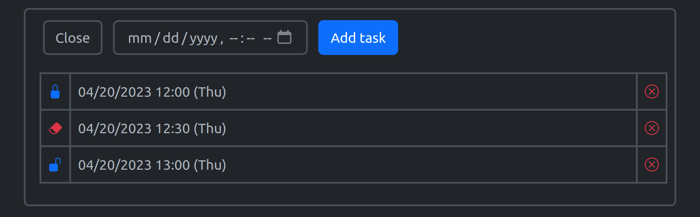
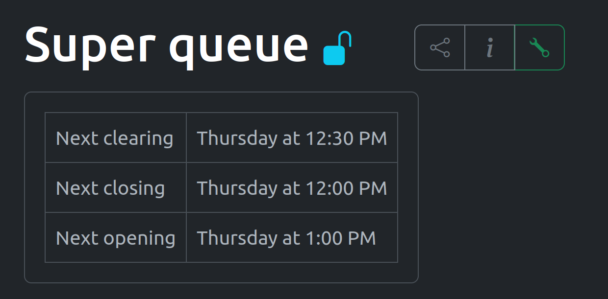

# QueueHere

Website for creating, managing and sharing queues.

Includes english and russian languages.

https://queue.hopto.org \
or \
http://queuehere.ru (just redirect, but i hope soon it will be a main domain name)

- [Demonstration](#demonstration)
- [Details](#details)

# Demonstration

## Options

## Queue

## Share

## Join

## Create

## Manage

# Details

Backend with python web framework [flask](https://flask.palletsprojects.com/en/2.2.x/).
Frontend with [bootstrap](https://getbootstrap.com/). \
I created it for queues for labs passing. It can be used in similar cases.

To run on your pc.

    # cloning
    git clone https://github.com/Vaniog/QueueHere
    cd QueueHere

    # creating virtual enviroment
    python3 -m venv
    
    # activating the enviroment

    # for windows
    # venv\Scripts\activate.bat

    # for linux
    # source venv/bin/activate
    
    # flask env variable
    export FLASK_APP=queue_app

    # running
    flask run -h 0.0.0.0

You can create app/.env file and load there some variables.
Look for them in app/config.py